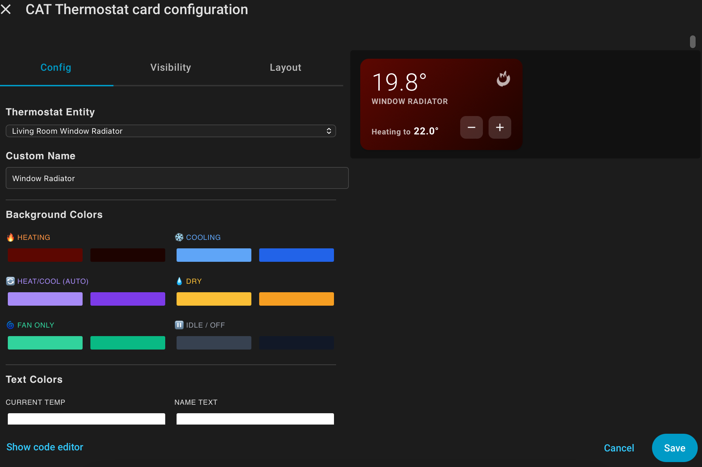

# CAT Thermostat Card

A beautiful, dynamic thermostat card for Home Assistant with animated HVAC mode indicators, customizable gradient backgrounds, and intuitive temperature controls.


*Visual editor with full customization options:*



## Features

- **Complete HVAC Mode Support**: Heating, Cooling, Heat/Cool (Auto), Dry, Fan Only, and Off states
- **Animated Mode Indicators**: Dynamic icons that breathe, pulse, or spin based on active mode
- **Click-to-Toggle Power**: Click any animated icon to instantly turn the thermostat on or off
- **Gradient Backgrounds**: Smooth color transitions for each HVAC mode with customizable colors
- **Manual Controls**: Quick +/- buttons to adjust temperature by 0.5° increments
- **Custom Icon Support**: Choose from popular Material Design Icons for each mode
- **Fully Customizable**: Configure all colors including gradients and text elements
- **Responsive Design**: Clean, compact layout that fits perfectly in your dashboard
- **Visual Editor**: Easy-to-use configuration interface within Home Assistant

## Installation

### HACS (Recommended)

1. Open HACS in your Home Assistant instance
2. Go to "Frontend"
3. Click the menu (⋮) and select "Custom repositories"
4. Add this repository URL and select "Dashboard" as the category
5. Click "Install"
6. Restart Home Assistant

### Manual Installation

1. Download `cat-thermostat-card.js`
2. Copy it to your `config/www/` directory
3. Add the following to your Lovelace resources:

```yaml
resources:
  - url: /local/cat-thermostat-card.js
    type: module
```

4. Restart Home Assistant

## Configuration

### Using the Visual Editor

1. Edit your dashboard
2. Click "Add Card"
3. Search for "CAT Thermostat Card"
4. Select your climate entity from the dropdown
5. Customize colors, icons, and appearance as desired

The visual editor includes sections for:
- **Thermostat Entity Selection**
- **Custom Name**
- **Background Colors** (6 gradient pairs for all HVAC modes)
- **Text Colors** (4 customizable text elements)
- **Custom Icons** (dropdown selectors with popular MDI icons)

### Manual YAML Configuration

```yaml
type: custom:cat-thermostat-card
entity: climate.bedroom_thermostat
name: Bedroom
# Heating colors
heat_start: '#fb923c'
heat_end: '#f97316'
# Cooling colors
cool_start: '#60a5fa'
cool_end: '#2563eb'
# Heat/Cool (Auto) colors
heat_cool_start: '#a78bfa'
heat_cool_end: '#7c3aed'
# Dry mode colors
dry_start: '#fbbf24'
dry_end: '#f59e0b'
# Fan only colors
fan_only_start: '#34d399'
fan_only_end: '#10b981'
# Idle/Off colors
idle_start: '#374151'
idle_end: '#111827'
# Text colors
current_temp_color: '#ffffff'
name_color: '#ffffff'
target_label_color: '#ffffff'
target_temp_color: '#ffffff'
# Custom icons (optional)
icon_heating: 'mdi:fire'
icon_cooling: 'mdi:snowflake'
icon_heat_cool: 'mdi:autorenew'
icon_dry: 'mdi:water-percent'
icon_fan_only: 'mdi:fan'
icon_off: 'mdi:power'
```

## Configuration Options

| Option | Type | Default | Description |
|--------|------|---------|-------------|
| `entity` | string | **Required** | Climate entity ID |
| `name` | string | Entity name | Custom display name |
| **Background Colors** |
| `heat_start` | color | `#fb923c` | Heating gradient start color |
| `heat_end` | color | `#f97316` | Heating gradient end color |
| `cool_start` | color | `#60a5fa` | Cooling gradient start color |
| `cool_end` | color | `#2563eb` | Cooling gradient end color |
| `heat_cool_start` | color | `#a78bfa` | Heat/Cool (Auto) gradient start color |
| `heat_cool_end` | color | `#7c3aed` | Heat/Cool (Auto) gradient end color |
| `dry_start` | color | `#fbbf24` | Dry mode gradient start color |
| `dry_end` | color | `#f59e0b` | Dry mode gradient end color |
| `fan_only_start` | color | `#34d399` | Fan only gradient start color |
| `fan_only_end` | color | `#10b981` | Fan only gradient end color |
| `idle_start` | color | `#374151` | Idle/Off gradient start color |
| `idle_end` | color | `#111827` | Idle/Off gradient end color |
| **Text Colors** |
| `current_temp_color` | color | `#ffffff` | Current temperature text color |
| `name_color` | color | `#ffffff` | Name text color |
| `target_label_color` | color | `#ffffff` | Target label text color |
| `target_temp_color` | color | `#ffffff` | Target temperature text color |
| **Custom Icons** |
| `icon_heating` | string | Default SVG | MDI icon for heating mode (e.g., `mdi:fire`) |
| `icon_cooling` | string | Default SVG | MDI icon for cooling mode (e.g., `mdi:snowflake`) |
| `icon_heat_cool` | string | Default SVG | MDI icon for heat/cool mode (e.g., `mdi:autorenew`) |
| `icon_dry` | string | Default SVG | MDI icon for dry mode (e.g., `mdi:water-percent`) |
| `icon_fan_only` | string | Default SVG | MDI icon for fan only mode (e.g., `mdi:fan`) |
| `icon_off` | string | Default SVG | MDI icon for off state (e.g., `mdi:power`) |

## Usage

### Interactive Controls

- **Click the card**: Opens the more-info dialog for detailed controls
- **Click the animated icon**: Toggles the thermostat on/off
- **Plus button**: Increases temperature by 0.5°
- **Minus button**: Decreases temperature by 0.5°

### Visual Indicators

The card automatically detects HVAC states and displays:

| Mode | Icon | Animation | Color |
|------|------|-----------|-------|
| **Heating** | 🔥 Flame | Breathing | Orange gradient |
| **Cooling** | ❄️ Snowflake | Breathing | Blue gradient |
| **Heat/Cool** | ⏳ Hourglass | Pulsing | Purple gradient |
| **Dry** | 💧 Water Drop | Breathing | Amber gradient |
| **Fan Only** | 🌀 Fan | Spinning | Green gradient |
| **Off** | ⏸️ Power | Static (dimmed) | Gray gradient |

### Power Toggle Behavior

When you click the animated icon:
- **If OFF**: Turns on to Auto/Heat_Cool mode (or first available mode)
- **If ON**: Turns the thermostat off

## Available Custom Icons

Each HVAC mode has a dropdown selector in the visual editor with these popular options:

### Heating Icons
- mdi:fire, mdi:fireplace, mdi:radiator, mdi:sun-thermometer, mdi:white-balance-sunny, mdi:thermometer-chevron-up, mdi:home-thermometer

### Cooling Icons
- mdi:snowflake, mdi:snowflake-variant, mdi:air-conditioner, mdi:thermometer-chevron-down, mdi:weather-snowy, mdi:glacier

### Heat/Cool (Auto) Icons
- mdi:autorenew, mdi:sync, mdi:thermometer-auto, mdi:heat-wave, mdi:swap-vertical, mdi:thermostat-auto

### Dry Icons
- mdi:water-percent, mdi:water-off, mdi:water-minus, mdi:air-humidifier-off, mdi:weather-sunny, mdi:weather-sunset

### Fan Only Icons
- mdi:fan, mdi:fan-speed-1/2/3, mdi:wind-turbine, mdi:weather-windy, mdi:air-filter

### Off/Power Icons
- mdi:power, mdi:power-off, mdi:power-standby, mdi:stop-circle, mdi:sleep, mdi:cancel

Leave any icon dropdown as "Default" to use the built-in animated SVG icons.

## Example Configurations

### All HVAC Modes (Full Featured)
```yaml
type: custom:cat-thermostat-card
entity: climate.main_hvac
name: Main HVAC
heat_start: '#ff6b35'
heat_end: '#f7931e'
cool_start: '#38bdf8'
cool_end: '#0284c7'
heat_cool_start: '#c084fc'
heat_cool_end: '#9333ea'
dry_start: '#fbbf24'
dry_end: '#d97706'
fan_only_start: '#34d399'
fan_only_end: '#059669'
icon_heating: 'mdi:fireplace'
icon_cooling: 'mdi:air-conditioner'
icon_heat_cool: 'mdi:thermostat-auto'
```

### Minimalist Dark Theme
```yaml
type: custom:cat-thermostat-card
entity: climate.bedroom
heat_start: '#dc2626'
heat_end: '#991b1b'
cool_start: '#0ea5e9'
cool_end: '#0369a1'
idle_start: '#27272a'
idle_end: '#18181b'
current_temp_color: '#fafafa'
name_color: '#a1a1aa'
```

### Monochrome with Custom Icons
```yaml
type: custom:cat-thermostat-card
entity: climate.office
heat_start: '#525252'
heat_end: '#262626'
cool_start: '#525252'
cool_end: '#262626'
icon_heating: 'mdi:thermometer-chevron-up'
icon_cooling: 'mdi:thermometer-chevron-down'
icon_off: 'mdi:power-standby'
```

## Compatibility

- Home Assistant 2023.x or newer
- Works with all `climate` entities
- Supports all HVAC modes: heat, cool, heat_cool, auto, dry, fan_only, off
- Responsive to `hvac_action` and `state` attributes
- Compatible with Material Design Icons (MDI)

## Troubleshooting

**Card shows "Select a Thermostat in the Visual Editor"**
- The entity hasn't been configured yet. Use the visual editor to select a climate entity.

**Colors not updating**
- Clear your browser cache and hard refresh (Ctrl+Shift+R or Cmd+Shift+R)

**Temperature controls not working**
- Ensure your climate entity supports the `set_temperature` service
- Check that your thermostat isn't in a read-only or locked mode

**Icons not changing**
- Make sure you've selected an icon from the dropdown (not just typed text)
- Custom icons require Material Design Icons to be loaded in Home Assistant

**Toggle not working**
- Verify your climate entity supports `turn_off` and `set_hvac_mode` services
- Some thermostats may have restricted modes based on their capabilities

## Support

If you encounter any issues or have feature requests, please open an issue on GitHub.

## Changelog

### v2.0.0
- Added support for all HVAC modes (Heat/Cool, Dry, Fan Only)
- Implemented click-to-toggle power functionality on icons
- Added custom icon selection with MDI support
- Enhanced visual editor with icon dropdowns
- Added mode-specific animations (breathing, pulsing, spinning)
- Improved state detection logic

### v1.0.0
- Initial release
- Basic heating/cooling support
- Gradient backgrounds
- Temperature controls

## License

MIT License - feel free to use and modify as needed!

---

**Created with ❤️ for the Home Assistant community**
