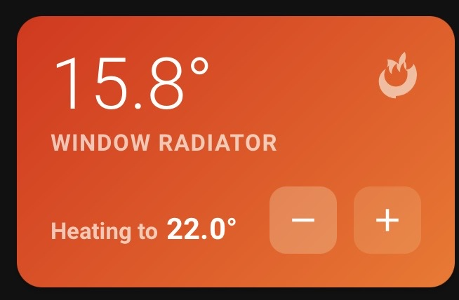

# CAT Radiator Card

A beautiful, dynamic thermostat card for Home Assistant with animated heating/cooling indicators, customizable gradient backgrounds, and intuitive temperature controls.



## Features

- **Dynamic Visual Feedback**: Animated flame/snowflake icons that pulse when heating or cooling
- **Gradient Backgrounds**: Smooth color transitions based on thermostat state (heating, cooling, or idle)
- **Manual Controls**: Quick +/- buttons to adjust temperature directly from the card
- **Fully Customizable**: Configure all colors including gradients and text elements
- **Responsive Design**: Clean, compact layout that fits perfectly in your dashboard
- **Visual Editor**: Easy-to-use configuration interface within Home Assistant

## Installation

### HACS (Recommended)

1. Open HACS in your Home Assistant instance
2. Go to "Frontend"
3. Click the menu (⋮) and select "Custom repositories"
4. Add this repository URL and select "Dashboard" as the category
5. Click "Install"
6. Restart Home Assistant

### Manual Installation

1. Download `cat-thermostat-card.js`
2. Copy it to your `config/www/` directory
3. Add the following to your Lovelace resources:

```yaml
resources:
  - url: /local/cat-thermostat-card.js
    type: module
```

4. Restart Home Assistant

## Configuration

### Using the Visual Editor

1. Edit your dashboard
2. Click "Add Card"
3. Search for "CAT Radiator Card"
4. Select your climate entity from the dropdown
5. Customize colors and appearance as desired

### Manual YAML Configuration

```yaml
type: custom:cat-thermostat-card
entity: climate.bedroom_radiator
name: Bedroom
heat_start: '#fb923c'
heat_end: '#f97316'
cool_start: '#60a5fa'
cool_end: '#2563eb'
idle_start: '#374151'
idle_end: '#111827'
current_temp_color: '#ffffff'
name_color: '#ffffff'
target_label_color: '#ffffff'
target_temp_color: '#ffffff'
```

## Configuration Options

| Option | Type | Default | Description |
|--------|------|---------|-------------|
| `entity` | string | **Required** | Climate entity ID |
| `name` | string | Entity name | Custom display name |
| `heat_start` | color | `#fb923c` | Heating gradient start color |
| `heat_end` | color | `#f97316` | Heating gradient end color |
| `cool_start` | color | `#60a5fa` | Cooling gradient start color |
| `cool_end` | color | `#2563eb` | Cooling gradient end color |
| `idle_start` | color | `#374151` | Idle gradient start color |
| `idle_end` | color | `#111827` | Idle gradient end color |
| `current_temp_color` | color | `#ffffff` | Current temperature text color |
| `name_color` | color | `#ffffff` | Name text color |
| `target_label_color` | color | `#ffffff` | Target label text color |
| `target_temp_color` | color | `#ffffff` | Target temperature text color |

## Usage

- **Click the card**: Opens the more-info dialog for detailed controls
- **Plus button**: Increases temperature by 0.5°
- **Minus button**: Decreases temperature by 0.5°

The card automatically detects heating/cooling states and displays:
- Animated flame icon when heating
- Animated snowflake icon when cooling
- No icon when idle
- Dynamic background gradients matching the current state

## Example Configurations

### Warm Orange Theme
```yaml
type: custom:cat-thermostat-card
entity: climate.living_room
heat_start: '#ff6b35'
heat_end: '#f7931e'
idle_start: '#4a5568'
idle_end: '#1a202c'
```

### Cool Blue Theme
```yaml
type: custom:cat-thermostat-card
entity: climate.bedroom
cool_start: '#38bdf8'
cool_end: '#0284c7'
idle_start: '#334155'
idle_end: '#0f172a'
```

### Dark Minimalist
```yaml
type: custom:cat-thermostat-card
entity: climate.office
heat_start: '#dc2626'
heat_end: '#991b1b'
idle_start: '#27272a'
idle_end: '#18181b'
current_temp_color: '#fafafa'
name_color: '#a1a1aa'
```

## Compatibility

- Home Assistant 2023.x or newer
- Works with all `climate` entities
- Supports heating, cooling, and idle states
- Responsive to `hvac_action` and `state` attributes

## Troubleshooting

**Card shows "Select a Radiator in the Visual Editor"**
- The entity hasn't been configured yet. Use the visual editor to select a climate entity.

**Colors not updating**
- Clear your browser cache and hard refresh (Ctrl+Shift+R or Cmd+Shift+R)

**Temperature controls not working**
- Ensure your climate entity supports the `set_temperature` service
- Check that your thermostat isn't in a read-only or locked mode

## Support

If you encounter any issues or have feature requests, please open an issue on GitHub.

## License

MIT License - feel free to use and modify as needed!

---

**Created with ❤️ for the Home Assistant community**
