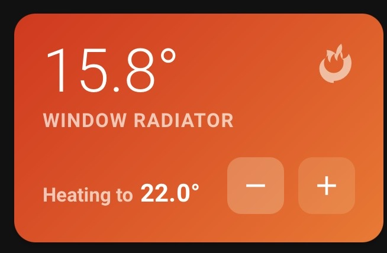
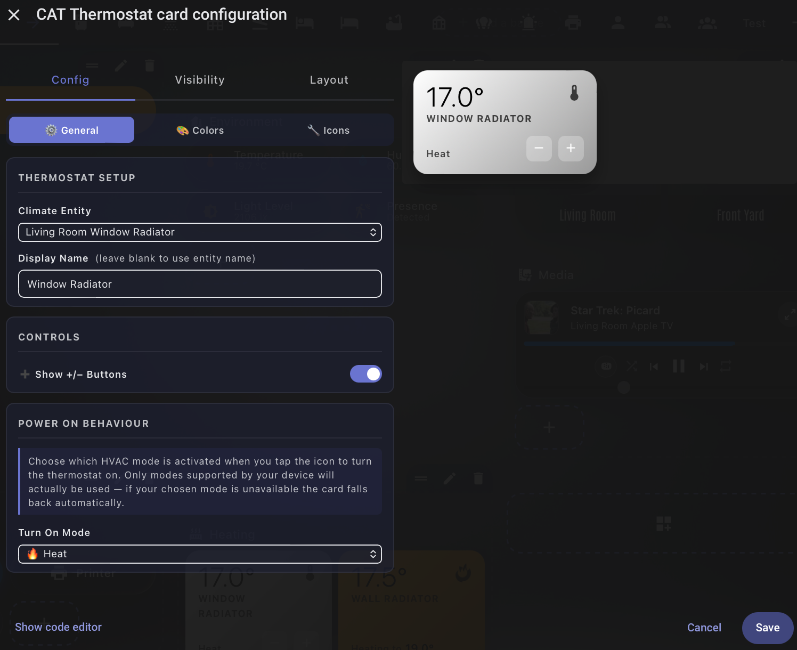

# CAT Thermostat Card

A sleek, fully customisable thermostat card for [Home Assistant](https://www.home-assistant.io/) with animated mode icons, per-mode gradient backgrounds, per-mode glass transparency, breathing glow effects, and a complete iOS-style Visual Editor — no YAML required.

[](https://github.com/jamesmcginnis/cat-thermostat-card)

-----

## Preview




-----

## Installation

### HACS — Recommended

[](https://my.home-assistant.io/redirect/hacs_repository/?owner=jamesmcginnis&repository=cat-thermostat-card&category=plugin)

1. Click the button above, **or** open HACS → Frontend → ⋮ → Custom repositories, paste `https://github.com/jamesmcginnis/cat-thermostat-card`, and set the category to **Dashboard**.
1. Search for **CAT Thermostat Card** and click Install.
1. Reload your browser.

### Manual

1. Download `cat-thermostat-card.js` from the [latest release](https://github.com/jamesmcginnis/cat-thermostat-card/releases/latest).
1. Copy it to `config/www/cat-thermostat-card.js`.
1. Go to **Settings → Dashboards → Resources** and add `/local/cat-thermostat-card.js` as a **JavaScript module**.
1. Reload your browser.

-----

## Usage

Add the card to any dashboard via the Visual Editor or YAML:

```yaml
type: custom:cat-thermostat-card
entity: climate.living_room
```

-----

## Configuration

All options are available in the Visual Editor. The full YAML reference is below.

### General

| Option        | Type   | Default       | Description                                                                   |
|---------------|--------|---------------|-------------------------------------------------------------------------------|
| `entity`      | string | **required**  | A `climate.*` entity                                                          |
| `name`        | string | entity name   | Display name shown on the card; leave blank to use the entity's friendly name |

### Controls

| Option          | Type    | Default | Description                                      |
|-----------------|---------|---------|--------------------------------------------------|
| `show_controls` | boolean | `true`  | Show or hide the +/− temperature buttons         |
| `turn_on_mode`  | string  | `auto`  | HVAC mode to activate when the power icon is tapped. `auto` picks the best available mode automatically. Options: `auto`, `heat`, `cool`, `heat_cool`, `dry`, `fan_only` |

### Background Gradients

Each HVAC mode has its own two-colour gradient. Both colours are individually configurable.

| Option                              | Default               | Description               |
|-------------------------------------|-----------------------|---------------------------|
| `heat_start` / `heat_end`           | `#fb923c` / `#f97316` | Heating gradient          |
| `cool_start` / `cool_end`           | `#60a5fa` / `#2563eb` | Cooling gradient          |
| `heat_cool_start` / `heat_cool_end` | `#a78bfa` / `#7c3aed` | Heat/Cool (auto) gradient |
| `dry_start` / `dry_end`             | `#fbbf24` / `#f59e0b` | Dry mode gradient         |
| `fan_only_start` / `fan_only_end`   | `#34d399` / `#10b981` | Fan Only gradient         |
| `idle_start` / `idle_end`           | `#374151` / `#111827` | Idle / Off gradient       |

### Glass / Transparency (per mode)

Set any mode's background to transparent with a frosted-glass outline instead of its gradient. Each mode is independently configurable.

| Option                  | Type    | Default | Description                                    |
|-------------------------|---------|---------|------------------------------------------------|
| `heat_transparent`      | boolean | `false` | Glass background when heating                  |
| `cool_transparent`      | boolean | `false` | Glass background when cooling                  |
| `heat_cool_transparent` | boolean | `false` | Glass background in heat/cool mode             |
| `dry_transparent`       | boolean | `false` | Glass background in dry mode                   |
| `fan_only_transparent`  | boolean | `false` | Glass background in fan only mode              |
| `idle_transparent`      | boolean | `false` | Glass background when idle or off              |

### Breathing Glow (per mode)

Enable a slow, looping pulse on the card for any mode. The card gently scales and radiates a coloured glow matched to that mode's palette. Each mode is independently configurable.

| Option              | Type    | Default | Description                               |
|---------------------|---------|---------|-------------------------------------------|
| `heat_breathe`      | boolean | `false` | Breathing glow when heating               |
| `cool_breathe`      | boolean | `false` | Breathing glow when cooling               |
| `heat_cool_breathe` | boolean | `false` | Breathing glow in heat/cool mode          |
| `dry_breathe`       | boolean | `false` | Breathing glow in dry mode                |
| `fan_only_breathe`  | boolean | `false` | Breathing glow in fan only mode           |
| `idle_breathe`      | boolean | `false` | Breathing glow when idle or off           |

### Text Colours

| Option               | Default   | Description                      |
|----------------------|-----------|----------------------------------|
| `current_temp_color` | `#ffffff` | Current temperature              |
| `name_color`         | `#ffffff` | Card name                        |
| `target_label_color` | `#ffffff` | Status label (e.g. "Heating to") |
| `target_temp_color`  | `#ffffff` | Target temperature               |

### Icon & Button Colours

| Option           | Default   | Description                                                       |
|------------------|-----------|-------------------------------------------------------------------|
| `icon_color`     | `#ffffff` | Mode icon colour                                                  |
| `btn_bg_color`   | `#ffffff` | +/− button background (rendered at 25% opacity for a glassy look)|
| `btn_icon_color` | `#ffffff` | +/− button symbol colour                                          |

### Custom Icons

By default the card uses built-in animated SVG icons for each mode. You can replace any with an MDI icon.

| Option           | Default                     | Description                        |
|------------------|-----------------------------|------------------------------------|
| `icon_heating`   | built-in animated flame     | MDI icon for heating mode          |
| `icon_cooling`   | built-in animated snowflake | MDI icon for cooling mode          |
| `icon_heat_cool` | built-in pulsing icon       | MDI icon for heat/cool (auto) mode |
| `icon_dry`       | built-in water drop         | MDI icon for dry mode              |
| `icon_fan_only`  | built-in spinning fan       | MDI icon for fan only mode         |
| `icon_idle`      | built-in thermostat display | MDI icon for idle state            |
| `icon_off`       | built-in power symbol       | MDI icon for the off / power state |

**Example using custom icons:**

```yaml
type: custom:cat-thermostat-card
entity: climate.living_room
icon_heating: mdi:radiator
icon_cooling: mdi:snowflake
icon_fan_only: mdi:fan
```

-----

## Full YAML Example

```yaml
type: custom:cat-thermostat-card
entity: climate.living_room
name: Living Room

# Controls
show_controls: true
turn_on_mode: heat

# Gradients
heat_start: '#fb923c'
heat_end: '#f97316'
cool_start: '#60a5fa'
cool_end: '#2563eb'
heat_cool_start: '#a78bfa'
heat_cool_end: '#7c3aed'
dry_start: '#fbbf24'
dry_end: '#f59e0b'
fan_only_start: '#34d399'
fan_only_end: '#10b981'
idle_start: '#374151'
idle_end: '#111827'

# Glass backgrounds (per mode)
heat_transparent: false
cool_transparent: true
idle_transparent: true

# Breathing glow (per mode)
heat_breathe: true
cool_breathe: false

# Text colours
current_temp_color: '#ffffff'
name_color: '#ffffff'
target_label_color: '#ffffff'
target_temp_color: '#ffffff'

# Icon & button colours
icon_color: '#ffffff'
btn_bg_color: '#ffffff'
btn_icon_color: '#ffffff'
```

-----

## Features at a Glance

- **Animated icons** — built-in flame, snowflake, spinning fan, pulsing heat/cool, and power icons; swap any for any MDI icon via the Visual Editor
- **Per-mode gradients** — a unique two-colour gradient for heating, cooling, heat/cool, dry, fan only, and idle/off; all 12 colours individually customisable
- **Per-mode glass / transparency** — replace any mode's gradient with a frosted-glass transparent background and subtle white outline, independently per mode
- **Per-mode breathing glow** — enable a slow, looping pulse with a mode-matched coloured glow on any or all modes independently
- **Power toggle** — tap the mode icon to turn the thermostat on or off; configure exactly which HVAC mode it turns on to
- **+/− temperature controls** — adjust the target temperature in 0.5° increments directly from the card
- **Full Visual Editor** — iOS-style three-tab editor (General, Colours, Icons) with colour pickers, hex readout, glass and breathe toggles per mode, and all options exposed; no YAML required

-----

## License

MIT © [jamesmcginnis](https://github.com/jamesmcginnis)
