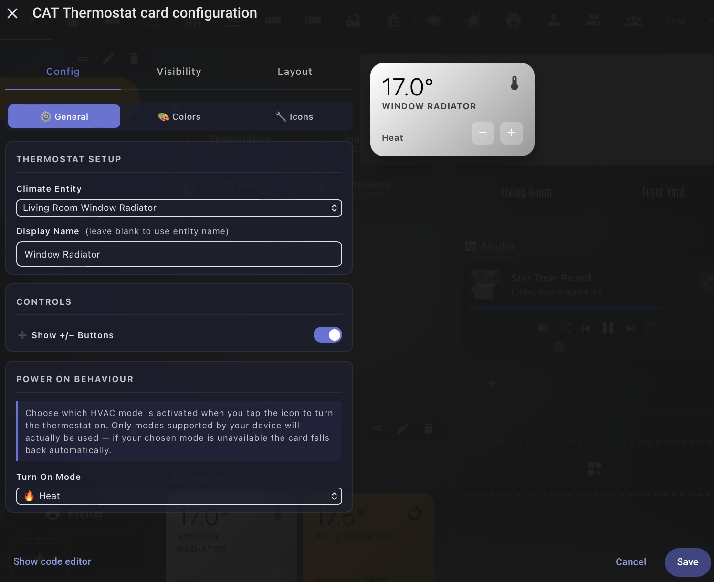

# CAT Thermostat Card

A sleek, fully customisable thermostat card for Home Assistant with animated mode icons, per-mode gradient backgrounds, and a complete Visual Editor — no YAML required.

-----

-----

## Features

- **Animated icons** — built-in flame, snowflake, spinning fan, pulsing heat/cool, and power symbol; swap any for any MDI icon
- **Per-mode gradients** — unique two-colour background for heating, cooling, heat/cool, dry, fan only, and idle/off; all 12 colours individually customisable
- **Idle icon behaviour** — choose whether the power icon shows when idle, or only when the thermostat is truly off (with the mode icon shown dimmed while idle)
- **Power toggle** — tap the mode icon to turn on or off; configure exactly which HVAC mode it powers on to
- **+/− temperature controls** — adjust the target in 0.5° increments directly from the card
- **Full Visual Editor** — three-tab editor with live gradient previews, colour pickers, icon selectors, and all controls; no YAML needed